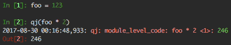

# qj
## logging designed for debugging
### (pronounced ‘queuedj’ /kjuːʤ/)

An easy-to-use but very expressive logging function.



If you have ever found yourself rewriting a list comprehension as a for loop, or
splitting a line of code into three lines just to store and log an intermediate
value, then this log function is for you.


## Overview:

qj is meant to help debug python quickly with lightweight log messages that are
easy to add and remove.

On top of the basic logging functionality, qj also provides a collection of
debugging helpers that are simple to use, including the ability to drop into
the python debugger in the middle of a line of code.


## Examples:

### Instead of turning this:
```
result = some_function(another_function(my_value))
```
#### into this:
```
tmp = another_function(my_value)
logging.info('tmp = %r', tmp)
result = some_function(tmp)
```
#### you can just do this:
```
result = some_function(qj(another_function(my_value)))
```

### Instead of turning this:
```
my_list = [process_value(value)
           for value in some_function(various, other, args)
           if some_condition(value)]
```
#### into this:
```
my_list = []
for value in some_function(various, other, args):
  logging.info('value = %r', value)
  condition = some_condition(value)
  logging.info('condition = %r', condition)
  if condition:
    final_value = process_value(value)
    logging.info('final_value = %r', final_value)
    my_list.append(final_value)
logging.info('my_list = %r', my_list)
```
#### you can keep it as the list comprehension:
```
my_list = qj([qj(process_value(qj(value)))
              for value in some_function(various, other, args)
              if qj(some_condition(value))])
```

## Philosophy:

There are two reasons we add logs to our code:
 1. We want to communicate something to the user of the code.
 2. **We want to debug.**

In python, as well as most other languages, the default logging mechanisms
serve the first purpose well, but make things unnecessarily difficult for the
second purpose.

### Debug logging should have no friction.

When you have of a question about your code, you should not be tempted to just
think hard to try to come up with the answer. Instead, you should know that
you can type just a few characters to see the answer.

### You should never have to rewrite code just to check it for bugs.

The most important feature of a debug logger is that it always returns its
argument. This allows you to add logging calls pretty much anywhere in your
code without having to rewrite your code or create temporary variables.

This is a minimal implementation of qj:
```
def qj(x):
  print(x)
  return x
```

Once you have that core property, there are a lot of other useful things you find
yourself wanting that make debugging easier. qj attempts to cleanly pull
debugging-related features together into a very simple power-user interface.
To that end, most argument names are single letters that are mnemonics for the
particular feature:
 - `x` is for the input that you want to log and return.
 - `s` is for the string you want to describe `x`.
 - `d` is for the debugger.
 - `b` is for the boolean that turns everything off.
 - `l` is for the lambda that lets you log more things.
 - `p` is for printing public properties of `x`.
 - `n` is for numpy array statistics.
 - `t` is for printing tensorflow Tensors.
 - `r` is for overriding the return value.
 - `z` is for zeroing out the log count and automatic indentation of a particular log.

A few less-commonly needed features get longer names:
 - `pad` is for padding a log message so that it stands out.
 - `tfc` is for checking numerics on tensorflow Tensors.
 - `tic` and `toc` are for measuring and logging timing of arbitrary chunks of code.
 - `time` is for measuring and logging timing stats for a callable.
 - `catch` is for catching exceptions from a callable.
 - `log_all_calls` is for wrapping `x` such that all public method calls and
   their return values get logged.

### The right description of `x` is usually its source code.

If you want to log the value of a variable named `long_variable_name`, you shouldn't
need to think about how to describe the variable in the log message so you can find it.
Its name and the line number where you are logging it are its best description.
`qj(long_variable_name)` logs something like this:
```
qj: <some_file> some_func: long_variable_name <line_number>: <value of long_variable_name>
```

Similarly, logging the value of a complicated expression should use the expression
itself as the description. `qj(foo * 2 + bar ** 2)` logs something like:
```
qj: <some_file> some_func: foo * 2 + bar ** 2 <line_number>: 42
```

### You shouldn't need to `import` just to log debug messages.

Ideally, something like qj would be available as a builtin in python. We can get pretty
close to that ideal by providing a way to install qj into the global namespace after
importing it the first time. This means that you can pretend qj is a builtin and use it
in any python code that runs after you import it once, even if the original import is in
some other file, package, or library.

### Adding logs should be easy. So should removing logs.

The name qj is meant to be easy to type (two characters in opposite hands) and
easy to search for and highlight in your code. 'qj' is one of the least
frequently occurring bigrams based on a survey of millions of lines of python
code, so it is hopefully very unlikely to occur naturally in your code. This
property will help you find and remove all of your debug logs easily once you
have fixed your bugs.

### Logs should be easy to read.

qj defaults to using colors. The metadata and description of the log are in red.
The value of the log is in green. Your debug logs will stand out strongly against
whatever normal logging your code does.


qj also works to align log messages nicely, where possible, to help you visually
group related log messages together.


## Basic Usage:

### Install with pip:
```
$ pip install qj
```

### Add the following import:
```
from qj_global import qj
```
This makes qj globally available in any python code that is run after the
import. It's often nice to import qj from your main script once, since you
can then use it in your entire project (and even in other python libraries).
See [Global Access](#global-access) for more information on importing.

### If your problem code looks like this:
```
def problem_code(...):
  ...
  problem_array = [other_func(value, other_args)
                   for value in compute_some_array(more_args)
                   if some_tricky_condition]
```
### Make it look like this:
```
def problem_code(...):
  ...
  problem_array = qj([qj(other_func(qj(value), qj(other_args)))
                      for value in qj(compute_some_array(qj(more_args)))
                      if qj(some_tricky_condition)])
```

In most cases, you shouldn't need to put logs on everything like that, of
course. If your debug cycle is fast, you can add the logs more selectively to
avoid getting overwhelmed by new logspam.

These changes will result in detailed logs that tell you what function they
are running in, what line number they are on, what source code for the log is,
and what its value is.

The log messages will also be indented some amount that corresponds to how
many calls to qj are in the current code context. This is particularly
useful with comprehensions, since python reports the last line of the
comprehension in logs and stack traces, which is often not the correct line
when dealing with long comprehensions (or even long argument lists).

### This is the general layout of the basic log message:
```
[datetime] qj: <file> function: [indentation] source code or description <line>: value
```
In the example above, the log messages might look like:
```
qj: <some_file> problem_code: more_args <92>: ['list', 'of', 'more_args']
qj: <some_file> problem_code:  compute_some_array(qj(more_args)) <92>: ['list', 'of', 'things', 'hey!']
qj: <some_file> problem_code:   some_tricky_condition <92>: True
qj: <some_file> problem_code:    other_args <92>: ['list', 'of', 'other_args']
qj: <some_file> problem_code:     value <92>: list
qj: <some_file> problem_code:      other_func(qj(value), qj(other_args)) <92>: other_func_return list
qj: <some_file> problem_code:   some_tricky_condition <92>: True
qj: <some_file> problem_code:    other_args <92>: ['list', 'of', 'other_args']
qj: <some_file> problem_code:     value <92>: of
qj: <some_file> problem_code:      other_func(qj(value), qj(other_args)) <92>: other_func_return of
qj: <some_file> problem_code:   some_tricky_condition <92>: False
qj: <some_file> problem_code:   some_tricky_condition <92>: True
qj: <some_file> problem_code:    other_args <92>: ['list', 'of', 'other_args']
qj: <some_file> problem_code:     value <92>: hey!
qj: <some_file> problem_code:      other_func(qj(value), qj(other_args)) <92>: other_func_return hey!
qj: <some_file> problem_code:       [qj(other_func(qj(value), qj(other_args))) ...] <92>: ['other_func_return list', 'other_func_return of', 'other_func_return hey!']
```

Things to note in that output:
  - The indentation automatically gives a visual indicator of how the
    comprehension is being computed -- you can see how the loops happen and
    when an iteration gets skipped at a glance or so (e.g., the two lines with
    the same indention should jump out, and closer inspection shows that the
    if statement generated the False, which explains why the
    previous indentation pattern didn't repeat).
  - You didn't have to specify any logging strings -- qj extracted the source code from the call site.

### You can change the description string with `qj(foo, 'this particular foo')`:
```
qj: <some_file> some_func: this particular foo <149>: foo
```

If qj can't find the correct source code, it will log the type of the output instead.
If that happens, or if you don't want to see the line of code, you might change the
previous logging to look like this:
```
def problem_code(...):
  ...
  problem_array = qj([qj(other_func(qj(value), qj(other_args)), 'other_func return')
                      for value in qj(s='computed array', x=compute_some_array(qj(more_args)))
                      if qj(s='if', x=some_tricky_condition)], 'problem_array')

qj: <some_file> problem_code: more_args <153>: ['list', 'of', 'more_args']
qj: <some_file> problem_code:  computed array <153>: ['list', 'of', 'things', 'hey!']
qj: <some_file> problem_code:   if <153>: True
qj: <some_file> problem_code:    other_args <153>: ['list', 'of', 'other_args']
qj: <some_file> problem_code:     value <153>: list
qj: <some_file> problem_code:      other_func return <153>: other_func_return list
qj: <some_file> problem_code:   if <153>: True
qj: <some_file> problem_code:    other_args <153>: ['list', 'of', 'other_args']
qj: <some_file> problem_code:     value <153>: of
qj: <some_file> problem_code:      other_func return <153>: other_func_return of
qj: <some_file> problem_code:   if <153>: False
qj: <some_file> problem_code:   if <153>: True
qj: <some_file> problem_code:    other_args <153>: ['list', 'of', 'other_args']
qj: <some_file> problem_code:     value <153>: hey!
qj: <some_file> problem_code:      other_func return <153>: other_func_return hey!
qj: <some_file> problem_code:       problem_array <153>: ['other_func_return list', 'other_func_return of', 'other_func_return hey!']
```
Note that both positional arguments `qj(value, 'val')` and keyword arguments `qj(s='val', x=value)` can be used.


## Advanced Usage:
These are ordered by the likelihood that you will want to use them.

### You can enter the debugger with `qj(d=1)`:
This drops you into the debugger -- it even works in jupyter notebooks!

You can use this to drop into the debugger in the middle of executing a comprehension:
```
[qj(d=(value=='foo'), x=value) for value in ['foo', 'bar']]

qj: <some_file> some_func: d=(value=='foo'), x=value <198>: foo
> <some_file.py>(198)some_func()
----> 198 [qj(d=(value=='foo'), x=value) for value in ['foo', 'bar']]

ipdb> value
'foo'
```


### You can selectively turn logging off with `qj(foo, b=0)`:
This can be useful if you only care about logging when a particular value shows up:
```
[qj(b=('f' in value), x=value) for value in ['foo', 'bar']]

qj: <some_file> some_func: b=('f' in value), x=value <208>: foo
```
Note the lack of a log for 'bar'.


### If logging is disabled for any reason, the other argument-based features will not trigger either:
```
qj(foo, d=1, b=(foo == 'foo'))
```
This will only drop into the debugger if `foo == 'foo'`.

Logging can be disabled for three reasons:
   1. `b=False`, as described above.
   2. `qj.LOG = False` (see [Parameters](#parameters) below).
   3. You are attempting to print more than `qj.MAX_FRAME_LOGS` in the current
      stack frame (see [Parameters](#parameters) below).


### You can log extra context with `qj(foo, l=lambda _: other_vars)`:
This is useful for logging other variables in the same context:
```
[qj(foo, l=lambda _: other_comp_var) for foo, other_comp_var in ...]

qj: <some_file> some_func: foo, l=lambda _: other_comp_var <328>: foo
qj: <some_file> some_func:                                        ['other', 'comprehension', 'var']
qj: <some_file> some_func: foo, l=lambda _: other_comp_var <328>: bar
qj: <some_file> some_func:                                        ['other', 'comprehension', 'var']
```

The input (`x`) is passed as the argument to the lambda:
```
qj(foo, l=lambda x: x.replace('f', 'z'))

qj: <some_file> some_func: foo, l=lambda x: x.replace('f', 'z') <336>: foo
qj: <some_file> some_func:                                             zoo

```
Note that qj attempts to nicely align the starts of log messages that are all generated from the same call to qj.


### You can log the timing of arbitrary code chunks with `qj(tic=1) ... qj(toc=1)`:
```
qj(tic=1)
do_a_bunch()
of_things()
qj(toc=1)

qj: <some_file> some_func: tic=1 <347>: Adding tic.
qj: <some_file> some_func:  toc=1 <350>: Computing toc.
qj:                                      2.3101 seconds since tic=1.
```

You can nest `tic` and `toc`:
```
qj(tic=1)
do_something()
qj(tic=2)
do_something_else()
qj(toc=1)
finish_up()
qj(toc=1)

qj: <some_file> some_func: tic=1 <348>: Adding tic.
qj: <some_file> some_func:  tic=2 <350>: Adding tic.
qj: <some_file> some_func:   toc=1 <352>: Computing toc.
qj:                                       0.5200 seconds since tic=2.
qj: <some_file> some_func:    toc=1 <354>: Computing toc.
qj:                                        1.3830 seconds since tic=1.
```

Since any `True` value will turn on `tic`, you can use it as a convenient identifier, as above where
`tic=2` is the second tic. The actual identifier printed by `toc` is whatever description string was
used for the `tic`, though, so you can give descriptive names just as in any other log message:
```
qj(foo, 'start foo', tic=1)
foo.start()
qj(foo.finish(), toc=1)

qj: <some_file> some_func: start foo <367>: <Foo object at 0x1165579d0>
qj:                                         Added tic.
qj: <some_file> some_func: foo.finish(), toc=1 <369>: Foo.SUCCESSFUL_FINISH
qj:                                                   5.9294 seconds since start foo.
```

You can use `tic` and `toc` in the same call to log the duration of any looping code:
```
[qj(x, tic=1, toc=1) for x in [1, 2, 3]]

qj: <some_file> some_func: x, tic=1, toc=1 <380>: 1
qj:                                               Added tic.
qj: <some_file> some_func: x, tic=1, toc=1 <380>: 2
qj:                                               0.0028 seconds since x, tic=1, toc=1.
qj:                                               Added tic.
qj: <some_file> some_func: x, tic=1, toc=1 <380>: 3
qj:                                               0.0028 seconds since x, tic=1, toc=1.
qj:                                               Added tic.
```

You can use `toc=-1` to clear out all previous `tic`s:
```
qj(tic=1)
do_something()
qj(tic=2)
do_something_else()
qj(tic=3)
finish_up()
qj(toc=-1)

qj: <some_file> some_func: tic=1 <394>: Adding tic.
qj: <some_file> some_func:  tic=2 <396>: Adding tic.
qj: <some_file> some_func:   tic=3 <398>: Adding tic.
qj: <some_file> some_func:    toc=1 <400>: Computing toc.
qj:                                        0.2185 seconds since tic=3.
qj:                                        0.5200 seconds since tic=2.
qj:                                        1.3830 seconds since tic=1.
```


### You can log the public properties for the input with `qj(foo, p=1)`:
```
qj(some_object, p=1)

qj: <some_file> some_func: some_object, p=1: some_object.__str__() output
qj:                                          Public properties:
    some_method(a, b=None, c='default')
    some_public_property
```
Note that this can be dangerous. In order to log the method signatures,
Python's `inspect` module can actually cause code to execute on your object.
Specifically, if you have `@property` getters on your object, that code will
be run. If your `@property` getter changes state, using this flag to print the
object's public API will change your object's state, which might make your
debugging job even harder. (Of course, you should never change state in a getter.)

This is generally useful to quickly check the API of an unfamiliar object
while working in a jupyter notebook.


### You can log some useful stats about x instead of its value with `qj(arr, n=1)`:
```
qj: <some_file> some_func: arr, n=1 (shape (min (mean std) max) hist) <257>: ((100, 1), (0.00085, (0.46952, 0.2795), 0.97596), array([25, 14, 23, 23, 15]))
```
This only works if the input (`x`) is a numeric numpy array or can be cast to one,
and if numpy has already been imported somewhere in your code. Otherwise, the value
of `x` is logged as normal.

The log string is augmented with a key to the different parts of the logged value.

The final value is a histogram of the array values. The number of histogram buckets
defaults to 5, but can be increased by passing an integer to `n` greater than 5:
```
qj(arr, n=10)

qj: <some_file> some_func: arr, n=10 ...: (..., array([11, 14, 8, 6, 10, 13, 14, 9, 7, 8]))
```


### You can add a `tensorflow.Print` call to `x` with `y = qj(some_tensor, t=1)`:
```
qj: <some_file> some_func: some_tensor, t=1 <258>: Tensor("some_tensor:0", ...)
qj:                                                Wrapping return value in tf.Print operation.
```
And then later:
```
sess.run(y)

qj: <some_file> some_func: some_tensor, t=1 <258>: [10 1] [[0.64550841]...
```
Note that the Tensorflow output includes the shape of the tensor first (`[10 1]`),
followed by its value. This only works if x is a `tf.Tensor` object and
`tensorflow` has already been imported somewhere in your code.

The number of logs printed from the `tf.Print` call is `qj.MAX_FRAME_LOGS`
(described [below](parameters), defaults to 200) if `t is True`. Otherwise,
it is set to `int(t)`. Thus, `t=1` prints once, but `t=True` prints 200 times.


### You can also turn on numerics checking for any `tf.Tensor` with `y = qj(some_tensor, tfc=1)`:
For example, `log(0)` is not a number:
```
y = qj(tf.log(tensor_with_zeros), tfc=1)

qj: <some_file> some_func: tf.log(tensor_with_zeros), tfc=1 <258>: Tensor("Log:0", ...)
qj:                                                                Wrapping return value in tf.check_numerics.
```
And then later:
```
sess.run(y)

InvalidArgumentError: qj: <some_file> some_func: tf.log(tensor_with_zeros), tfc=1 <258> : Tensor had Inf values
```
Note that tf.check_numerics is very slow, so you won't want to leave these in your graph.
This also only works if x is a `tf.Tensor` object and `tensorflow` has already been
imported somewhere in your code.

### You can override the return value of qj by passing any value to `r`:
```
some_function(normal_arg, special_flag=qj(some_value, r=None))

qj: <some_file> some_func: some_value, r=None <272>: some flag value
qj:                                                  Overridden return value: None
```
As in the example, this can be useful to temporarily change or turn off a
value being passed to a function, rather than having to delete the value,
which you might forget about.


### You can add timing logs to any function with `@qj(time=1)` or `qj(foo, time=100)`:
```
@qj(time=1)
def foo():
  ...

qj: <some_file> module_level_code: time=1 <343>: Preparing decorator to measure timing...
qj:                                              Decorating <function foo at 0x111b2bc80> with timing function.

foo()

qj: <some_file> some_func: Average timing for <function foo at 0x111c3eb18> across 1 call <343>: 0.0021 seconds
```
Note that the log message is reported from the location of the call to the function that generated the message
(in this case, line 343 in `some_file.py`, inside of `some_func`).

Setting `time` to a larger integer value will report timing stats less freqently:
```
foo = qj(foo, time=1000)
for _ in range(1000):
  foo()

qj: <some_file> some_func: foo, time=1000 <359>: <function foo at 0x111b2be60>
qj:                                              Wrapping return value in timing function.
qj: <some_file> some_func: Average timing for <function foo at 0x111b2be60> across 1000 calls <361>: 0.0023 seconds
```


### You can catch exceptions and drop into the debugger with `@qj(catch=1)` or `qj(foo, catch=<subclass of Exception>)`:
```
@qj(catch=1)
def foo(): raise Exception('FOO!')

qj: <some_file> module_level_code: catch=1 <371>: Preparing decorator to catch exceptions...
qj:                                               Decorating <function foo at 0x112086f50> with exception function.

foo()

qj: <some_file> some_func: Caught an exception in <function foo at 0x112086f50> <377>: FOO!
> <some_file.py>(377)<some_func>()
----> 1 foo()

ipdb>
```

This can be particularly useful in comprehensions where you want to be able to inspect
the state of the comprehension that led to an exception:
```
[qj(foo, catch=1)(x) for x in [1, 2, 3]]

qj: <some_file> some_func: foo, catch=1 <389>: <function foo at 0x1129dd7d0>
qj:                                            Wrapping return value in exception function.
qj: <some_file> some_func: Caught an exception in <function foo at 0x1129dd7d0> <389>: FOO!
...
> <some_file.py>(389)<some_func>()
----> 1 [qj(foo, catch=1)(x) for x in [1, 2, 3]]

ipdb> x
1
```
Setting `catch` will always drop into the debugger when an exception is caught -- this feature
is for debugging exceptions, not for replacing appropriate use of `try: ... except:`.


### You can log all future calls to an object with `qj(foo, log_all_calls=1)`:
```
s = qj('abc', log_all_calls=1)

qj: <some_file> some_func: 'abc', log_all_calls=1 <380>: abc
qj:                                                      Wrapping all public method calls for object.

s.replace('a', 'b')

qj: <some_file> some_func:  calling replace <385>: replace('a', 'b')
qj: <some_file> some_func:  returning from replace <385>: bbc
```

This can break your code in a variety of ways and fail silently in other ways, but some problems
are much easier to debug with this functionality. For example, figuring out why sequences of numbers
from a seeded random number generator differ on different runs with the same seed:
```
rng = qj(np.random.RandomState(1), log_all_calls=1)

qj: <some_file> some_func: np.random.RandomState(1), log_all_calls=1 <395>: <mtrand.RandomState object at 0x10c16e780>
qj:                                                                         Wrapping all function calls for object.

for k in set(list('abcdefghijklmnop')):
  rng.randint(ord(k))

# First run:
qj: <some_file> some_func: calling randint <413>: randint(97)
qj: <some_file> some_func: returning from randint <413>: 37
qj: <some_file> some_func: calling randint <413>: randint(99)
qj: <some_file> some_func: returning from randint <413>: 12
qj: <some_file> some_func: calling randint <413>: randint(98)
qj: <some_file> some_func: returning from randint <413>: 72
...


# Subsequent run with a reseeded rng:
qj: <some_file> some_func: calling randint <413>: randint(101)
qj: <some_file> some_func: returning from randint <413>: 9
qj: <some_file> some_func: calling randint <413>: randint(100)
qj: <some_file> some_func: returning from randint <413>: 75
qj: <some_file> some_func: calling randint <413>: randint(103)
qj: <some_file> some_func: returning from randint <413>: 5
...
```
This fails (in theory, but not as written) because sets are iterated in an undefined order.
Similar failures are possible with much more subtle structure. Comparing different series
of log calls makes it very easy to find exactly where the series diverge, which gives a good
chance of figuring out what the bug is.


### You can make particular log messages stand out with `qj(foo, pad=<str or int>)`:
```
qj(foo, pad='#')

##################################################
qj: <some_file> some_func: foo, pad='#' <461>: foo
##################################################
```

Similarly, add blank lines:
```
qj(foo, pad=3)

# Some other log message...


qj: <some_file> some_func: foo, pad=3 <470>: foo


# The next log message...
```

## Parameters:

### There are seven global parameters for controlling the logger:
  1. `qj.LOG`: Turns logging on or off globally. Starts out set to True, so
               logging is on.
  2. `qj.LOG_FN`: Which log function to use. All log messages are passed to this
                  function as a fully-formed string, so the only constraints are
                  that this function takes a single parameter, and that it _is_
                  a function -- e.g., you can't set `qj.LOG_FN = print` unless
                  you are using `from __future__ import print_function` (although
                  you can define your own log function that just calls print if
                  you don't like the default). Defaults to `logging.info` wrapped
                  in a lambda to support colorful logs.
  3. `qj.STR_FN`: Which string conversion function to use. All objects to be logged
                  are passed to this function directly, so it must take an arbitrary
                  python object and return a python string. Defaults to `str`, but a
                  nice override is `pprint.pformat`.
  4. `qj.MAX_FRAME_LOGS`: Limits the number of times per stack frame the logger
                          will print for each qj call. If the limit is hit, it
                          prints an informative message after the last log of the
                          frame. Defaults to 200.
  5. `qj.COLOR`: Turns colored log output on or off globally.  Starts out set to
                 True, so colorized logging is on.
  6. `qj.PREFIX`: String that all qj logs will use as a prefix. Defaults to `'qj: '`.
  7. `qj.DEBUG_FN`: Which debugger to use. You shouldn't need to set this in most
                    situations. The function needs to take a single argument, which
                    is the stack frame that the logger should start in. If this is
                    not set, then the first time debugging is requested, qj attempts
                    to load ipdb. If ipdb isn't available, it falls back to using pdb.
                    In both cases, `qj.DEBUG_FN` is set to the respective `set_trace`
                    function in a manner that supports setting the stack frame.


## Global Access:
In many cases when debugging, you need to dive into many different files
across many different modules. In those cases, it is nice to have a single
logging and debugging interface that is immediately available in all of the
files you touch, without having to import anything additional in each file.

To support this use case, you can call the following function after importing
in one file:
```
from qj import qj
qj.make_global()
```
This will add qj to python's equivalent of a global namespace, allowing you
to call qj from any python code that runs after the call to
`qj.make_global()`, no matter what file or module it is in.

When using qj from a jupyter notebook, qj.make_global() is automatically called
when qj is imported.

As described in [Basic Usage](basic-usage), you can also just use:
```
from qj_global import qj
```
This is generally what you want, but qj does not force you to pollute the global
namespace if you don't want to (except in jupyter notebooks).


## qj Magic Warning:

qj adds a local variable to the stack frame it is called from. That variable is
`__qj_magic_wocha_doin__`. If you happen to have a local variable with the same
name and you call qj, you're going to have a bad time.


## Testing:

qj has extensive tests. You can run them with nosetests:
```
$ nosetests
........................................................................................
----------------------------------------------------------------------
Ran 88 tests in 1.341s

OK
```

Or you can run them directly:
```
$ python qj/tests/qj_test.py
........................................................................................
----------------------------------------------------------------------
Ran 88 tests in 1.037s

OK
```

If you have both python 2.7 and python 3.6+ installed, you can test both versions:
```
$ nosetests --where=qj/tests --py3where=qj/tests --py3where=/qjtests3
$ python3 qj/tests/qj_test.py
$ python3 qj/tests3/qj_test.py
```

## Disclaimer:

This project is not an official Google project. It is not supported by Google
and Google specifically disclaims all warranties as to its quality,
merchantability, or fitness for a particular purpose.


## Contributing:

See how to [contribute](./CONTRIBUTING.md).


## License:

[Apache 2.0](./LICENSE).